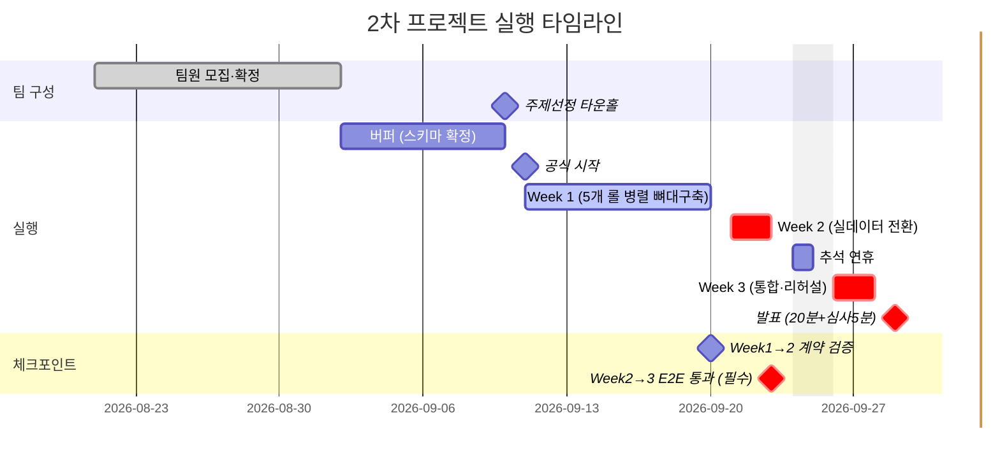

> 관련 문서: [[11.KickOFF]] · [[24. 기능명세서 v1]] · [[15. 기능 백로그 & 마켓플레이스 로드맵]] · [[01. PM TODO board]]
> **상태**: 🌱 초안 — 팀 합류 전 PM이 먼저 그려본 병렬 작업 계획. 롤별 세부 방식(TBD)은 버퍼 기간~Week 1 초반에 담당자가 직접 확정. 여기 있는 건 "이 정도 그림이면 다들 뭘 해야 할지 감이 온다" 수준의 시작점이지 최종 배정이 아님.
> **2026-08-24 실제 일정 반영**: 학교 공식 공지 수신 — 팀 최종 확정 9/2, 주제선정 타운홀 9/10, 프로젝트 공식 시작 9/11, 발표 9/29(타운홀, 팀별 20분+심사5분). 아래 "Week 1/2/3"은 더 이상 임의 가정이 아니라 이 실제 날짜에 맞춘 것.

## 0. 왜 이 문서가 필요한가
5개 롤(데이터 파이프라인·ML·Azure 인프라·RAG/자동화·대시보드)이 실질적으로 약 2.5주(9/11~9/28, 추석 이틀 제외) 동안 동시에 움직인다. [[24. 기능명세서 v1]] 1절의 크로스커팅 계약(Dataverse 스키마·Security Role·데이터 흐름 순서)만 지키면 서로 안 보고 일해도 맞물리게 설계돼 있지만, "정말 맞물리는지" 확인할 시점을 미리 못박아두지 않으면 마지막 주에 가서야 어긋난 걸 발견하는 사고가 난다. 이 문서는 (1) 실제 날짜에 맞춘 롤별 주차 초안과 (2) 그걸 어떻게 체크할지를 함께 정리한다.

## 0-1. 실제 캘린더 매핑
| 구간 | 날짜 | 비고 |
| --- | --- | --- |
| 팀 최종 확정 | 9/2(수) | 학교 공식 마감 |
| 버퍼 (Week 0에 해당) | 9/2 ~ 9/10 | 스키마 확정·스파이크테스트·멘토링을 여기서 끝내면 유리 |
| 주제선정 타운홀 | 9/10(목) | |
| **Week 1** | 9/11(금, 공식 시작) ~ 9/20(일) | 9/14 9시간 수업 |
| **Week 2** | 9/21(월) ~ 9/23(수) | 9/21·22 9시간, 9/23 4시간 수업 — **추석 전 마감** |
| 추석 연휴 | 9/24~25 | 작업 없음으로 가정 |
| **Week 3** | 9/26(토) ~ 9/28(월) | 9/28 9시간 수업이 마지막 준비일 |
| 발표 | 9/29(화) | 타운홀, 팀별 20분 발표 + 심사 5분, 시간초과 시 중단 |

**Week 2가 원래 계획보다 짧다(7일→3일).** 추석 연휴가 통합 직전에 끼어 있어서, Week 2 안에 실데이터 전환과 1차 E2E 통과를 못 끝내면 Week 3에 만회할 시간이 사실상 없다. 이 문서의 체크포인트가 특히 Week 2 끝(9/23)에 몰려있는 이유.

> 롤별 상세 작업은 아래 표(1절) 참고 — 여기 간트차트는 전체 일정의 모양만 보여준다.

## 1. 롤별 주차별 초안
각 셀은 "이 정도는 돼야 다음 롤이 안 막힌다" 기준의 최소선. 확정 아님 — 버퍼 기간에 담당자 실력·시간에 맞춰 조정.

| 롤         | Week 1 (9/11~9/20, Mock 기준 뼈대)                                           | Week 2 (9/21~9/23, 실데이터 전환)                          | Week 3 (9/26~9/28, 통합·검증)         |
| --------- | ------------------------------------------------------------------------ | ---------------------------------------------------- | --------------------------------- |
| 데이터 파이프라인 | Mock 데이터셋 준비, held-out 생성 스크립트(`generate_v4.py`) 확장 착수                   | nqnq.db 실데이터로 배치 전환, 학습 cutoff 8/20 적용               | 9월 held-out 정답 데이터 최종 고정·격리       |
| ML·모델링    | 피처 엔지니어링 + 로컬 학습 뼈대, mock 데이터로 학습 1회 통과                                  | 실데이터 재학습, 1차 정확도 측정                                  | 예측 vs held-out 오차율 계산 스크립트        |
| Azure 인프라 | Dataverse `ReorderRecommendation` 테이블 실제 생성 + 필드 확장, Security Role 2종 세팅 | 실제 ML 결과 Dataverse 적재 테스트, 승인자 권한 실사용자 매핑            | 스키마 동결(freeze), 예외 케이스 점검         |
| RAG·자동화   | Power Automate 트리거 뼈대(Dataverse 레코드 생성 → Teams 카드 발송까지 목업)               | 실제 Dataverse 이벤트 연동, Teams Adaptive Card 문구 실데이터로 교체 | 승인 → 상태 업데이트 전체 흐름 리허설            |
| 대시보드·프론트  | React 스캐폴딩, 승인이력·예측대조 2뷰 컴포넌트 뼈대(mock 데이터)                               | Dataverse API 연동, 실제 승인 클릭 동작 확인                     | 예측대조 뷰에 오차율 시각화 반영, 20분 발표 분량 맞추기 |

## 2. 병렬 작업 체크 방법

### 2-1. 크로스커팅 계약을 "깨면 안 되는 인터페이스"로 취급
[[24. 기능명세서 v1]] 1절이 5개 롤이 서로 안 보고도 맞물리게 해주는 유일한 접점이다. **이 계약(필드명·타입·흐름 순서)을 바꿔야 할 일이 생기면 그 자리에서 바로 팀 채널에 공지** — Week 3까지 들고 있으면 늦는다.

### 2-2. 주 경계 통합 체크포인트 (15~30분)
- **9/20 (Week 1 → 2 경계)**: 각자 만든 뼈대를 Mock 데이터로 한 번 실제로 이어본다(데모 아님, 형식이 계약과 맞는지만 확인). 필드명·타입이 다르면 여기서 잡는다.
- **9/23 (Week 2 → 3 경계, 추석 직전 — 가장 중요한 체크포인트)**: 실데이터로 `예측 → Dataverse → Teams 승인 → 발주확정`까지 **한 번이라도 끝까지** 통과시킨다. 여기서 안 되면 추석 연휴(9/24~25) 동안 손 놓고 있다가 9/28 하루 만에 통합+리허설을 다 해야 하는 최악의 시나리오가 됨.
- **9/28 (발표 하루 전)**: 최종 통합 확인 + 20분 발표 리허설(시간 재보기).

### 2-3. 비동기 일일 체크인 (Teams, 동기 스탠드업 대신)
학생 프로젝트 특성상 매일 같은 시간에 모이기 어려우므로, 정해진 시각까지 Teams 채널에 텍스트로 "어제 한 일 / 오늘 할 일 / 막힌 것"만 짧게 남긴다. 회의 없이도 누가 지금 뭘 하는지 확인 가능.

### 2-4. TODO 보드에 롤 태그 추가
[[01. PM TODO board]]의 기존 `#todo/week0~3` 체계에 롤 태그(`#role/data` · `#role/ml` · `#role/infra` · `#role/rag` · `#role/dashboard`)를 추가해서, Dataview 쿼리로 "롤별로 뭐가 남았는지"를 대시보드에서 바로 본다.

### 2-5. Blocked는 다음 체크포인트를 기다리지 않는다
병렬 작업의 가장 큰 리스크는 **한 롤이 막히면 뒤 롤도 순서대로 막히는 것**(데이터 → ML → Dataverse → 자동화 → 대시보드 순서 의존). 막히면 `#blocked` 태그를 달고 즉시 팀 채널에 알리는 걸 규칙으로 — 체크포인트까지 기다리지 않는다.

## 3. 다음 논의 (Week 0)
- [ ] 위 롤별 주차 표를 실제 담당자 실력·시간에 맞춰 재조정 #todo/week0
- [ ] 일일 체크인 게시 마감 시각 합의 #todo/week0
- [ ] `#blocked` 알림을 Teams 어느 채널/스레드에 남길지 정하기 #todo/week0
