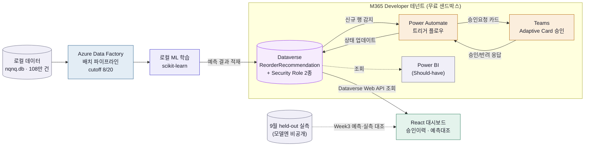

> 관련 문서: [[11. KickOFF]] · [[22. Cost Plan]] · [[24. 기능명세서 v1]] · [[15. 기능 백로그 & 마켓플레이스 로드맵]]
> **상태**: 🔄 2026-08-24 전면 재작성 — 이전 버전은 D365/Dataverse 피벗 이전 초안(NQNQ를 실제 제품으로, GenAI 마케팅 생성을 핵심 기능으로 서술)이라 나머지 문서와 어긋나 있었음. 아래는 피벗 이후 확정된 방향을 반영. 원안 전체는 8절에 백로그로 보존.

## Vision
기획-생산-마케팅-판매-고객 피드백까지, 상품의 전체 생애주기(End-to-End)를 AI와 유관부서 협업으로 자동화하는 **스마트 커머스 OS**. 장기적으로는 이 비전을 지향하지만, **2차 프로젝트(9/11~9/28, 추석 제외 실질 약 2.5주)는 이 중 일부만 구현**한다.

## 0. 제품 정체성 (재확인)
- **만드는 것**: **Fashion AI Agent Appservice**(가칭) — Dynamics 365/Dataverse 위에 얹는 패션 버티컬 AI SCM 애드온
- **NQNQ**: 우리 제품이 아니라 "지그재그가 만든 가상 PB 브랜드"라는 검증용 시뮬레이션 배경(가상 고객사)일 뿐. 108만 건 가상 주문 데이터를 낸 소스([[NQNQ Basic Frame|30.DATA]])
- 포지셔닝·경쟁분석 상세: [[12. Market Research]]

## 1. AI 핵심 엔진 — 2차 스코프

### ① ML 기반 수요예측 & 자동발주 추천 (Predictive ML Engine)
- 체형별·컬러별 판매 데이터, 날씨, 프로모션 일정을 학습해 SKU별 수요 예측
- 품절위험 SKU → Dataverse `ReorderRecommendation` 레코드 자동 생성 (필드 정의: [[24. 기능명세서 v1]])
- 9월 held-out 데이터와 대조해 정확도를 라이브 검증 ([[16. PPT plan]])

### ② Teams 승인 코파일럿 (RAG Collaboration → Approval Workflow로 재정의)
- 원래 구상은 사내 RAG 챗봇(`@NQNQ_AI` 형태의 상시 질의응답)이었으나, 2차 스코프에서는 **Power Automate + Teams Adaptive Card 승인 워크플로우**로 축소·재정의
- 예측 → 발주추천 → Teams 카드로 승인 요청 → 클릭 한 번으로 확정
- 정책문서 질의응답 형태의 실제 RAG는 Tier 2 백로그로 유보 ([[15. 기능 백로그 & 마켓플레이스 로드맵]])

> 원래 3대 엔진 중 **③ GenAI 마케팅 콘텐츠 생성(카피라이팅·AI 룩북 시뮬레이션)은 2차 스코프에서 완전 제외**. 장기 아이디어로는 유효해서 원안 그대로 8절에 보존.

## 2. 핵심 데모 흐름 (2차 스코프)
흐름 원문은 [[24. 기능명세서 v1]] 0절이 원본 — 이 흐름이 전부다. 부서별 다중 워크플로우(마케팅 소재 검토, 디자이너 스펙 검토 등 @태그 자동 연동)는 이번 스코프에 없음 — 확정 제외 목록도 같은 문서 3절 참고.

## 3. 대시보드 화면 구성 (2차 스코프)
React 대시보드는 2뷰만 구현:
- **승인이력 뷰**: 발주추천 레코드의 상태(Pending/Approved/Rejected) 목록
- **예측대조 뷰**: ML 예측치 vs 9월 held-out 실측치 비교

기존 구상(Left Sidebar 4탭: Overview/ML Forecast/AI Marketing Studio/RAG Workspace)은 스코프 밖 — 8절 참고.

## 4. 인프라
Dataverse 단일 저장소 구조(Cosmos DB 서빙 레이어 제외). 비용 원칙과 레이어별 확정안은 [[22. Cost Plan]] 참고.

## 5. 다음 논의 (Week 0)
- [ ] Teams 승인 카드에 "예측근거 자연어 설명" GenAI 기능을 붙일지 ([[14. 1차 프로젝트 대비 차별화 아이디어]] 논의 5-①, Tier 1 스트레치 후보) — 기술 설계 초안은 7절 참고(2026-08-26 추가) #todo/week0
- [ ] 7절 "MAI 대화형 후속 질의" 확장까지 갈지, 아니면 1~2문장 요약형(기본안)에서 멈출지 — 코어 MVP 배포 속도에 영향 없게 반드시 스트레치로 분리해서 결정 (2026-08-27 추가) #todo/week0

## 6. 시스템 아키텍처 다이어그램
실선이 핵심 데모 경로, 점선은 Should-have(Power BI)·검증용(held-out 대조) 보조 경로. 박스 색은 담당 롤을 뜻함 — 아래 표 참고.

### 롤별 담당 범위 (2026-08-27 4인 체제로 갱신 — 5개 기능영역, 실제 사람은 4명)
> 롤을 잘게 나누는 대신 "진짜 테크팀처럼" 책임영역 단위로 묶는 방향만 정해짐. **누가 어느 영역을 맡을지는 협의 중** — 담당자는 전부 미정.

| 기능 영역 | 담당 컴포넌트 | 담당자 | Week 0에 먼저 끝나야 하는 이유 |
| --- | --- | --- | --- |
| 데이터 파이프라인 | Azure Data Factory 배치 파이프라인 | (협의 예정) | ML이 학습할 데이터셋이 없으면 다음 단계 자체가 시작 안 됨 |
| Azure 인프라 | Dataverse 테이블 스키마 + Security Role 2종 | (협의 예정) | **가장 먼저 확정돼야 함** — 나머지가 전부 이 테이블을 보고 작업 |
| RAG·자동화 | Power Automate 트리거 + Teams Adaptive Card | (협의 예정) | Dataverse 스키마가 정해져야 어떤 필드로 카드를 채울지 정할 수 있음 |
| ML·모델링 | 로컬 학습 스크립트, 예측 결과 산출, risk_score 구현 | (협의 예정) | Dataverse에 적재할 필드(예측값·위험점수)의 형태가 여기서 정해짐 |
| 대시보드·프론트 | React 대시보드 2뷰, (Should) Power BI | (협의 예정) | 같은 이유로 Dataverse 스키마에 의존 — 파이프라인의 마지막 소비자 |
| PM/TPM | 크로스커팅 계약 관리, 체크포인트 운영, 블로커 해소, 발표자료 | 본인 | 4개 영역이 서로 안 부딪히는지 계속 확인해야 함 |

---

## 7. 예측근거 자연어 설명 — 기술 설계 초안 (Tier 1 스트레치, MAI 패턴 참고)
> 5절 오픈 질문("Teams 승인 카드에 예측근거 자연어 설명 GenAI 기능을 붙일지")에 대한 기술 설계 초안. 2026-08-26 추가 — 채택 여부는 여전히 Week 0 팀 논의로 확정하되, 채택 시 아래 구조로 시작.
> 참고: 무신사 [MATCH Console & MAI](https://techblog.musinsa.com/match-console-mai-e65b2cfd687e) 사례의 ReAct(탐색→생성→검증) 패턴과 Context-aware Prompting 구조를 예측근거 설명 기능에 대입. 출력 형식은 토스 [LLM 맥락 기반 주제 분류](https://toss.tech/article/llm_context_topic) 사례의 Structured Output 원칙(JSON 스키마 고정) 참고.

**목표**: Teams 승인 카드에 "왜 이 SKU가 위험한지"를 risk_score 숫자만이 아니라 1~2문장 자연어로 덧붙여, MD가 승인 여부를 더 빠르게 판단하게 함.

### 파이프라인 (ReAct 축소판)
1. **탐색(Reasoning)**: risk_score 산출에 쓰인 근거 데이터를 조회 — 최근 N일 판매속도, 리드타임 대비 남은 재고소진일, 카테고리별 계절 민감도 계수([[74. Real-World Data Grounding (Weather & Body)]]), 임박한 프로모션 유무
2. **생성(Acting)**: 위 근거를 구조화 컨텍스트로 프롬프트에 주입 → LLM이 1~2문장 요약을 생성. 완전 자유생성이 아니라 **Structured Output**(`{"summary": string, "key_factor": string, "confidence": number}`)으로 제한해 Teams 카드 필드에 그대로 매핑
3. **검증(Guardrail)**: 생성된 `key_factor`가 실제 입력 피처 중요도 상위 3개 안에 있는지 규칙 기반으로 대조 — 근거 없는 설명(hallucination) 방지용 최소 안전장치

### 왜 완전 자동생성이 아닌가
MAI 사례처럼 AI가 만든 결과를 운영자가 최종 확인하는 **Human-in-the-loop** 구조를 유지 — Teams 카드는 자연어 설명을 "참고용 1줄"로만 노출하고, 승인/반려 최종 판단과 근거 숫자(risk_score 등)는 그대로 카드에 유지.

이 설계는 감이 아니라 실제 XAI(설명가능AI) 연구 근거가 있음 — 설명이 항상 좋은 게 아니라 **"과신(over-reliance)"을 유발할 수 있다**는 게 반복적으로 보고됨. 그래서 "설명은 참고만, 최종판단은 사람"이라는 위 원칙을 의도적으로 못박아둔 것.
- [Explainable recommendation: when design meets trust calibration](https://link.springer.com/article/10.1007/s11280-021-00916-0)
- [Explain To Decide: A Human-Centric Review on the Role of XAI in AI-assisted Decision Making](https://arxiv.org/pdf/2312.11507) (arXiv)
- [Aligning explanations with human values: context-sensitive trust calibration in AI decision systems](https://www.tandfonline.com/doi/full/10.1080/0144929X.2026.2662402) (2026)

### 학술적 뿌리 — ReAct
위 파이프라인(탐색→생성→검증)과 7-1절 대화형 확장은 무신사 MATCH/MAI가 실무적으로 구현한 패턴이고, 그 학술적 원본은 Yao et al., ["ReAct: Synergizing Reasoning and Acting in Language Models"](https://react-lm.github.io/), ICLR 2023(arXiv:2210.03629) — 실무 사례(블로그)와 원논문을 같이 인용하면 설계 근거가 더 탄탄해짐.

### 의존성
- Azure OpenAI 학교 커리큘럼 학습 완료 여부는 [[05. 참고자료 목록 & 학습공백 확인]] 참고 — 이미 Tier 1 스트레치로 분류돼 있음
- risk_score 산출 공식이 먼저 확정돼야 "근거 데이터" 항목이 정해짐 → 공식은 [[23. Alert & Trigger Rules]]에서 신규 확정(2026-08-26)

### 7-1. MAI 대화형 후속 질의 — 심화 확장안 (2026-08-27 추가, 1차 프로젝트 대비 차별화 강화용)
> 위 기본안(1~2문장 요약 붙이기)까지가 Tier 1 스트레치의 최소선. 아래는 그 위에 얹는 **추가 심화**로, 코어 MVP 배포와 완전히 분리된 독립 스트레치 — 시간 남을 때만 시도.

**배경**: 무신사 MATCH는 단순 데이터 허브가 아니라 "고객 접점마다 최적의 비즈니스 의사결정을 연결하는 레이어"로 설계됐고, MAI는 그 위에서 ReAct 기반으로 **사람이 되물어보면 답하는** 상시 어시스턴트다. 지금 우리 7절 기본안은 "예측근거를 카드에 한 줄 박아두는" 정적 정보 노출에 그쳐서, MATCH/MAI가 실제로 하는 "질의응답형 의사결정 지원"까지는 못 간다.

**확장 아이디어**: Teams 승인 카드에 "더 물어보기" 버튼을 추가해, MD가 "왜 이 SKU가 위험해?", "얼마나 더 시켜야 돼?" 같은 자유 질문을 하면 7절의 ReAct 파이프라인(탐색→생성→검증)을 재사용해 같은 근거 데이터로 답하는 구조. 완전히 새로 만드는 게 아니라 **기본안의 탐색 단계를 카드 클릭 1회성이 아니라 반복 호출 가능하게** 여는 정도의 확장.

**1차 프로젝트 대비 의미**: 1차 RAG는 "질문→리포트 생성, 끝"이었음([[14. 1차 프로젝트 대비 차별화 아이디어]] 참고). 우리 코어는 이미 "예측→승인→발주 액션"까지 가서 그 자체로 앞서 있는데, 여기에 MAI식 대화형 레이어까지 얹으면 "액션으로 이어지는 대화형 의사결정 코파일럿"이라는, 1차와 완전히 다른 카테고리의 포지셔닝이 가능함. 발표에서 MATCH/MAI를 실제 벤치마킹 사례로 인용 가능.

**전제**: 코어 MVP(승인 카드 정적 요약)가 먼저 끝까지 배포·QA된 뒤에만 착수 — 순서 바뀌면 안 됨.

---

## 8. 백로그 원안 — 장기 비전 (2차 스코프 밖, 참고용 보존)

> 아래는 피벗 이전 초안을 그대로 보존한 것. NQNQ를 지그재그 내부 실제 시스템처럼 서술하고 있지만, 지금 시점에서는 "우리 제품을 도입한 회사가 언젠가 이 수준까지 확장한다면"이라는 장기 가정으로 읽어야 함. [[15. 기능 백로그 & 마켓플레이스 로드맵]] Tier 3(장기 비전)에 해당.

### GenAI 마케팅 & 비주얼 스튜디오
- **체형별 타겟 카피라이팅 자동 생성**: 제품 스펙만 넣으면 [스트레이트/웨이브/내추럴] 체형별 인스타그램 릴스 대본 및 카카오 알림톡 문구 자동 작성
- **AI 모델 룩북 시뮬레이션**: 샘플 이미지 1장으로 [155cm 키작녀 / 168cm 키큰녀] 등 다양한 체형 모델의 착용 컷을 AI로 생성해 상세페이지 비주얼 자동 세팅

### End-to-End 상품 생애주기 워크플로우 (스마트 OS 5단계)
[1. AI 기획/트렌드] ➔ [2. ML 발주/생산] ➔ [3. AI 마케팅 생성] ➔ [4. 유관부서 자동승인] ➔ [5. 판매/RAG 피드백]

| 단계 | 주요 기능 및 AI의 역할 | 유관부서 자동 연동 (@태그) |
| :--- | :--- | :--- |
| **1. 기획** | 지그재그 체형 키워드 분석 ➡️ AI가 결점 보정 신상품 기획서 Draft 생성 | `@박지민(디자이너)` 스펙 검토 요청 |
| **2. 생산** | ML 기반 적정 수량 예측 ➡️ 공장 견적 및 원가 자동 계산 | `@강수진(회계)` 예산 자동 승인 대기 |
| **3. 마케팅** | AI가 숏폼 대본, 상세페이지 문구, AI 착샷 이미지 자동 생성 | `@최유진(마케터)` 소재 검토 및 바이럴 |
| **4. 입고/판매** | 직진배송 센터 바코드 매핑 ➡️ 지그재그 앱 체형 필터 탭 자동 등록 | `@윤도현(개발)` & `@임재범(물류)` 알림 |
| **5. 피드백** | RAG 피드백 분석: "허리가 커요" 리뷰 수집 ➡️ 다음 패턴 개선안 자동 추출 | `@NQNQ_Cell` 전체 주간 리포트 발송 |

### 확장 대시보드 레이아웃
- **Left Sidebar**: 📊 Overview(통합 KPI) · 📦 Product & ML Forecast(상품/생산) · 🎨 AI Marketing Studio(마케팅) · 💬 RAG Workspace(협업/승인)
- **Main Screen**: [AI Alert Zone] — "⚠️ [인생 슬랙스 Short-S] 재고가 3일 뒤 품절 예상됩니다. 공장에 500벌 추가 발주할까요? [예측 보고서 보기] [원클릭 발주 승인]"
- **Right Panel**: RAG AI 챗봇 창 + 유관부서 태그 대화창(슬랙을 대체하는 자체 소통 채널) — `@NQNQ_AI`로 물어보면 사내 문서를 찾아 답변하는 상시 코파일럿
