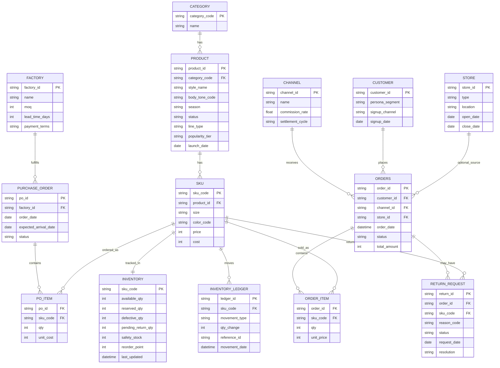

> 관련 문서: [[OBSIDIAN/2026_MS_DATASCHOOL/20.PROJECT/22.MS_2nd_Project/01.MS_2nd_Project_Team/30.DATA/31. NQNQ_data Frame/70. Data Model & Architecture/71. Entity Definitions & Data Dictionary]]
> Obsidian에서 이 코드블록은 자동으로 다이어그램으로 렌더링됩니다 (Mermaid 코어 플러그인 필요, 기본 활성화됨).

## 핵심 트랜잭션 ERD (1차 모델링)

## 📝 변경 이력
- v1.0: 최초 13개 엔터티 설계
- v1.1: `INVENTORY_LEDGER` 추가 — 재고 스냅샷만으로는 이동 이력 추적이 안 되는 문제 보완 (트러블슈팅·감사 대응 목적)
- v1.2: `RETURN_REQUEST`에 `sku_code` FK 추가 — 가상데이터 생성 중 발견: order_id만으로는 다중 아이템 주문에서 "어떤 SKU가 반품됐는지" 구분 불가능했던 문제 보완
- v1.3: `INVENTORY.sku_code`의 키 타입을 `PK_FK`(잘못된 문법) → `PK`로 수정 — Mermaid ERD 문법에는 복합 키 타입 표기가 없어 파싱 에러 발생, mermaid.parse()로 직접 검증 후 수정
- v1.4: `PRODUCT`에 `line_type`(BASIC/TREND) 필드 추가 — 트렌드 캡슐 라인 도입([[OBSIDIAN/2026_MS_DATASCHOOL/20.PROJECT/22.MS_2nd_Project/00.MS_2nd_Project_PM/30.DATA/31. NQNQ_data Frame/20. Product & Catalog/21. Core Product Categories]])에 따라 베이직/트렌드 라인 구분 필요
- v1.5: `PRODUCT`에 `popularity_tier`(HERO/STEADY/NICHE) 필드 추가 — SKU 수 부족 문제 해결 위해 디자인 라인업 확장하며 롱테일 판매 가중치 도입

세부 필드 정의는 [[OBSIDIAN/2026_MS_DATASCHOOL/20.PROJECT/22.MS_2nd_Project/01.MS_2nd_Project_Team/30.DATA/31. NQNQ_data Frame/70. Data Model & Architecture/71. Entity Definitions & Data Dictionary]] 참고.
